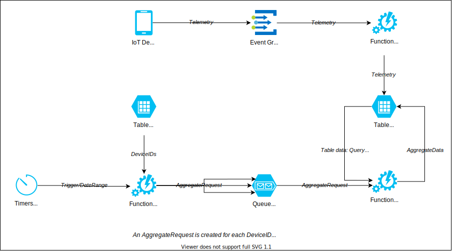

# Flume

Azure Function App serverless data pipeline for the Log Cabin project.

## Tables

### DeviceTelemetry

Stores the raw telemetry from the devices.

- PartitionKey: CustomerID_DeviceID
- RowKey: Unix timestamp as recorded by the device

### Summary

Stores aggregate DeviceTelemetry data.

- Partitions: CustomerID_DeviceID_SummaryTimespan
- RowKey: Unix timestamp of summary start time
- Timespans include HOURLY, DAILY, and WEEKLY

### Device

- PartitionKey: CustomerID
- RowKey: DeviceID

### User

- PartitionKey: CustomerID
- RowKey: UserID

## Data Pipeline

The following diagram is a little bit outdated, but the general flow remains the same.

## Research: Table Design

The table is modelled so that queries from the UI can be executed as efficiently as possible. I anticipate that the sensors will upload telemetry hourly, and that the charts in the UI will want the following data:

| Date Range | Granularity |
| ---------- | ----------- |
| 1 week     | Hourly      |
| 1 month    | Daily       |
| 1 year     | Weekly      |

The [Azure table storage design guidelines](https://docs.microsoft.com/en-us/azure/storage/tables/table-storage-design-for-query) state that these are the most efficient queries:

- A Point Query is the most efficient lookup to use and is recommended to be used for high-volume lookups or lookups requiring lowest latency. Such a query can use the indexes to locate an individual entity very efficiently by specifying both the PartitionKey and RowKey values. For example: `$filter=(PartitionKey eq 'Sales') and (RowKey eq '2')`
- Second best is a Range Query that uses the PartitionKey and filters on a range of RowKey values to return more than one entity. The PartitionKey value identifies a specific partition, and the RowKey values identify a subset of the entities in that partition. For example: `$filter=PartitionKey eq 'Sales' and RowKey ge 'S' and RowKey lt 'T'`
